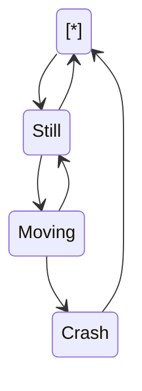
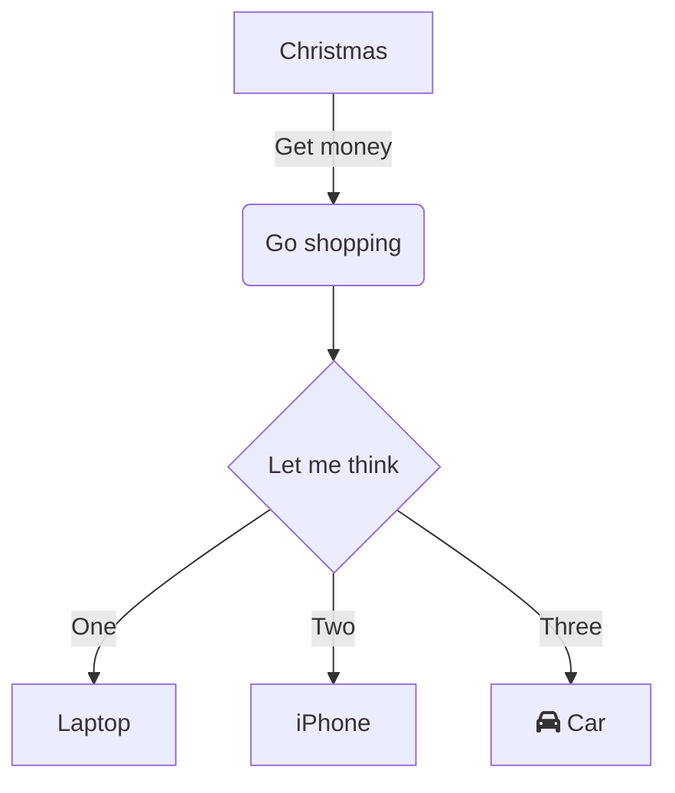
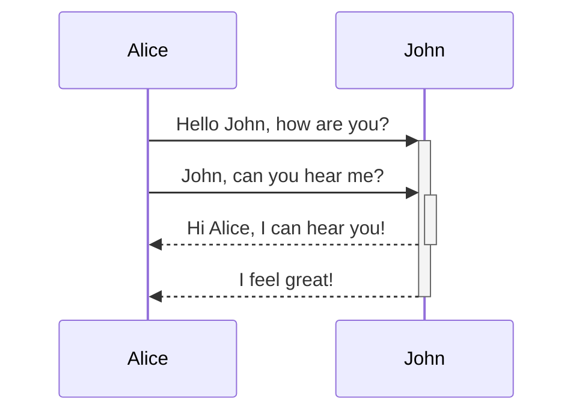

These two functions identify the type of geometric object.
<!-- NOTE-swimm-snippet: the lines below link your snippet to Swimm -->
### 📄 RTreeContainer/RTreeContainer.cpp
```c++
8      bool IsPoint(RTreeContainer::BoxValue const& v)
9      {
10         // A comment
11         return v.second.type == 1;
12     }
13     
14     bool IsRect(RTreeContainer::BoxValue const& v)
15     {
16         return v.second.type == 0;
17     }
```

<br/>

<!--MERMAID {width:100}-->

<!--MCONTENT {content: "stateDiagram-v2<br/>\n\\[\\*\\] \\-\\-\\> Still<br/>\nStill \\-\\-\\> \\[\\*\\]<br/>\nStill \\-\\-\\> Moving<br/>\nMoving \\-\\-\\> Still<br/>\nMoving \\-\\-\\> Crash<br/>\nCrash \\-\\-\\> \\[\\*\\]<br/>\n<br/>"} --->

<br/>

These are the include files used for the program.
<!-- NOTE-swimm-snippet: the lines below link your snippet to Swimm -->
### 📄 RTreeContainer/RTreeContainer.h
```c
4      #include <vector>
5      #include <tuple>
6      
7      #include <boost/geometry.hpp>
8      #include <boost/geometry/geometries/point.hpp>
9      #include <boost/geometry/geometries/box.hpp>
10     #include <boost/geometry/geometries/polygon.hpp>
11     
12     #include <boost/geometry/index/rtree.hpp>
13     
14     #include <QDebug>
15     
16     namespace bg = boost::geometry;
17     namespace bgi = boost::geometry::index;
```

<br/>

<!--MERMAID {width:100}-->

<!--MCONTENT {content: "graph TD<br/>\nA\\[Christmas\\] \\-\\-\\>|Get money| B(Go shopping)<br/>\nB \\-\\-\\> C{Let me think}<br/>\nC \\-\\-\\>|One| D\\[Laptop\\]<br/>\nC \\-\\-\\>|Two| E\\[iPhone\\]<br/>\nC \\-\\-\\>|Three| F\\[fa:fa-car Car\\]<br/>\n<br/>"} --->

<br/>

Draw a box
<!-- NOTE-swimm-snippet: the lines below link your snippet to Swimm -->
### 📄 RTreeGUI/GraphicBox.cpp
```c++
8      GraphicBox::GraphicBox(qreal x, qreal y, qreal width, qreal height, const QColor &color, const QColor &hightlightColor, QGraphicsItem* parent) :
9          QGraphicsRectItem(x, y, width, height, parent),
10         mColor(color),
11         mHighlightColor(hightlightColor)
12     {
13         setPen(color);
14     }
15     
```

<br/>

These are the static constant values for the class
<!-- NOTE-swimm-snippet: the lines below link your snippet to Swimm -->
### 📄 RTreeGUI/MainWindow.h
```c
21         static constexpr unsigned int minBoxSize = 10;
22         static constexpr unsigned int maxBoxSize = 100;
23         static constexpr unsigned int pointDiameter = 5;
24         static constexpr unsigned int minXPos = 10;
25         static constexpr unsigned int maxXPos = 600;
26         static constexpr unsigned int minYPos = 10;
27         static constexpr unsigned int maxYPos = 440;
```

<br/>

<!--MERMAID {width:100}-->

<!--MCONTENT {content: "sequenceDiagram<br/>\nAlice->>+John: Hello John, how are you?<br/>\nAlice->>+John: John, can you hear me?<br/>\nJohn\\-\\-\\>>-Alice: Hi Alice, I can hear you!<br/>\nJohn\\-\\-\\>>-Alice: I feel great!<br/>\n\n<br/>"} --->

<br/>

This file was generated by Swimm. [Click here to view it in the app](/repos/Z2l0aHViJTNBJTNBQm9vc3RHZW9tZXRyeUV4cGVyaW1lbnQlM0ElM0FNYXJrVlRlY2g=/docs/kh9fo).
