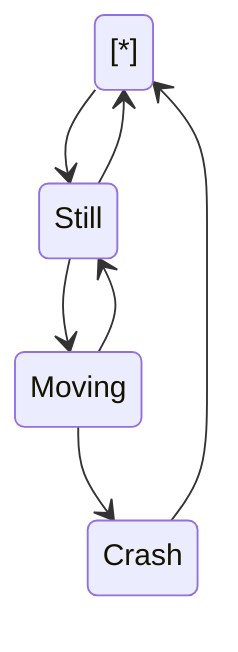

These two functions identify the type of geometric object.
<!-- NOTE-swimm-snippet: the lines below link your snippet to Swimm -->
### 📄 RTreeContainer/RTreeContainer.cpp
```c++
8      bool IsPoint(RTreeContainer::BoxValue const& v)
9      {
10         // A comment
11         return v.second.type == 1;
12     }
13     
14     bool IsRect(RTreeContainer::BoxValue const& v)
15     {
16         return v.second.type == 0;
17     }
```

<br/>

<!--MERMAID {width:100}-->

<!--MCONTENT {content: "stateDiagram-v2<br/>\n\\[\\*\\] \\-\\-\\> Still<br/>\nStill \\-\\-\\> \\[\\*\\]<br/>\nStill \\-\\-\\> Moving<br/>\nMoving \\-\\-\\> Still<br/>\nMoving \\-\\-\\> Crash<br/>\nCrash \\-\\-\\> \\[\\*\\]<br/>\n\n<br/>"} --->

<br/>

This file was generated by Swimm. [Click here to view it in the app](/repos/Z2l0aHViJTNBJTNBQm9vc3RHZW9tZXRyeUV4cGVyaW1lbnQlM0ElM0FNYXJrVlRlY2g=/docs/kh9fo).
