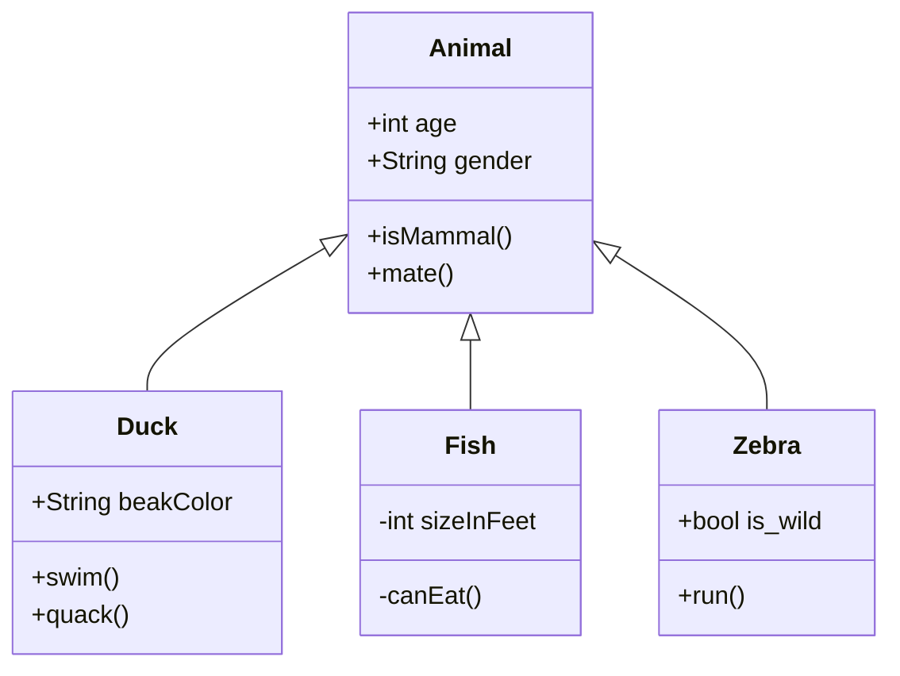

These two functions identify the type of geometric object.
<!-- NOTE-swimm-snippet: the lines below link your snippet to Swimm -->
### 📄 RTreeContainer/RTreeContainer.cpp
```c++
8      bool IsPoint(RTreeContainer::BoxValue const& v)
9      {
10         // A comment
11         return v.second.type == 1;
12     }
13     
14     bool IsRect(RTreeContainer::BoxValue const& v)
15     {
16         return v.second.type == 0;
17     }
```

<br/>

<!--MERMAID {width:100}-->

<!--MCONTENT {content: "classDiagram<br/>\nAnimal <|-- Duck<br/>\nAnimal <|-- Fish<br/>\nAnimal <|-- Zebra<br/>\nAnimal : +int age<br/>\nAnimal : +String gender<br/>\nAnimal: +isMammal()<br/>\nAnimal: +mate()<br/>\nclass Duck{<br/>\n+String beakColor<br/>\n+swim()<br/>\n+quack()<br/>\n}<br/>\nclass Fish{<br/>\n\\-int sizeInFeet<br/>\n\\-canEat()<br/>\n}<br/>\nclass Zebra{<br/>\n+bool is\\_wild<br/>\n+run()<br/>\n}<br/>\n<br/>"} --->

<br/>

This file was generated by Swimm. [Click here to view it in the app](/repos/Z2l0aHViJTNBJTNBQm9vc3RHZW9tZXRyeUV4cGVyaW1lbnQlM0ElM0FNYXJrVlRlY2g=/docs/kh9fo).
